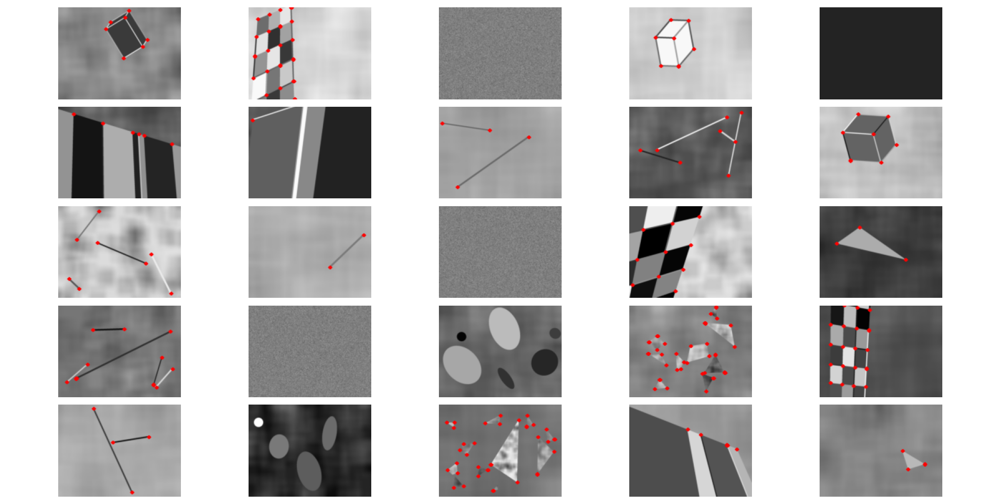

# MagicPoint Implementation – Achieving State-of-the-Art Performance

## 🚀 Overview
I recently implemented **MagicPoint**, the base detector from the paper *SuperPoint: Self-Supervised Interest Point Detection and Description*, and was excited to achieve an **mAP of 0.9721**, which closely matches the original paper’s reported **0.971**, validating the effectiveness of my implementation.

This journey involved overcoming various technical challenges, optimizing training, and uncovering key insights into deep learning practices. Below, I share my results and important lessons learned along the way.

---

## 📌 Results
### 🔹 MagicPoint’s Output
Here’s a visualization of MagicPoint’s detections on several images:

### 🔹 Training Performance
Below are the mAP and Loss curves from training:

*(Insert training curves here)*

---

## 🔍 Key Learnings
### 1️⃣ Weight Initialization Matters More Than You Think!
By default, TensorFlow initializes CNN layers using **Glorot Uniform**, but for **ReLU** activations, the **He Normal** initializer is more effective. Switching to He Normal improved training stability and convergence.

### 2️⃣ Normalizing Inputs? There’s More to It!
I used to normalize images by dividing pixel values by **255**, assuming it was sufficient. However, after reading *Delving Deep into Rectifiers: Surpassing Human-Level Performance on ImageNet Classification*, I realized that proper variance propagation across layers requires inputs to be standardized (mean = 0, std = 1). This significantly impacts training stability and performance.

---

## 📚 References
- [SuperPoint: Self-Supervised Interest Point Detection and Description](https://arxiv.org/abs/1712.07629)
- [Delving Deep into Rectifiers: Surpassing Human-Level Performance on ImageNet Classification](https://arxiv.org/abs/1502.01852)

---

## ✨ Conclusion
This project was a great learning experience! From achieving **state-of-the-art results** to understanding **initialization and input normalization**, this journey has deepened my knowledge of deep learning best practices.

Feel free to check out the code, experiment with it, and contribute! 🚀

**📩 Questions or feedback?** Open an issue or start a discussion!
